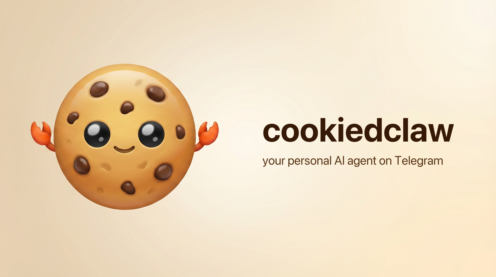

<p align="center">
  
</p>

# cookiedclaw

A Claude Code plugin that brings Telegram into your CC session: text your bot from anywhere, CC does the work using your claude.ai subscription, the reply lands back in the chat.

> **Status:** early POC. Right now it's just a custom channel — `--dangerously-load-development-channels` is required because we're not on the Anthropic-curated allowlist yet. Multi-bot, hooks for tool progress, onboarding wizard, and image/file dispatch are planned next.

## Prerequisites

- [Bun](https://bun.sh) (`curl -fsSL https://bun.sh/install | bash`)
- [Claude Code](https://code.claude.com) v2.1.80+, logged in with a claude.ai account (Console / API key auth doesn't support channels)
- A Telegram bot token from [@BotFather](https://t.me/BotFather)
- Your Telegram user ID (DM [@userinfobot](https://t.me/userinfobot))

## Setup

```bash
bun install
```

Set the env in your shell (or a `.env` file in this directory — Bun loads it automatically):

```sh
TELEGRAM_BOT_TOKEN=123456:abc...
TELEGRAM_ALLOWED_USERS=12345678,87654321   # your Telegram user ID(s), comma-separated
```

Anyone not in `TELEGRAM_ALLOWED_USERS` gets dropped silently — without that allowlist, your bot becomes a prompt-injection vector.

## Run

From this directory:

```bash
claude --dangerously-load-development-channels server:telegram
```

CC reads:

- `.mcp.json` → spawns the Telegram channel server (`src/telegram-channel.ts`)
- `.claude/settings.json` → registers PreToolUse / PostToolUse hooks pointing at `hooks/tool-progress.ts`
- `--dangerously-load-development-channels server:telegram` → opts the Telegram MCP server in as a *channel* so its push notifications reach your session (the flag is required because we're not on the Anthropic-curated allowlist yet)

> **Don't** pass `--plugin-dir .` for development. It causes CC to register the same MCP server twice (once as project, once as plugin), and our channel opt-in flag only applies to one of them — you'll end up with a working tool but no inbound message routing. The `.claude-plugin/plugin.json` and `hooks/hooks.json` files are kept for the eventual marketplace publish, where the plugin-loading path takes over.

DM your bot. The message arrives in your CC terminal as a `<channel source="telegram" chat_id="..." sender="...">` event. While CC runs tools you'll see a live message in Telegram update like:

```
⏳ Bash: ls -la
✓ Read: /tmp/notes.md (45ms)
⏳ WebFetch: https://...
```

When CC calls the `reply` tool, the progress message is deleted and replaced by the final answer.

## Debugging

Both the channel server and the hook script append diagnostic lines to `~/.cache/cookiedclaw/progress.log`. If something doesn't reach Telegram, that log usually shows where the chain broke (server didn't bind, hook couldn't find port, no active chat, etc.).

## What works today

- Telegram channel server (MCP + `claude/channel`) — DMs become `<channel>` events in CC
- Reply tool with **MarkdownV2** rendering (CommonMark in, properly-escaped Telegram out via `telegramify-markdown`)
- **Live tool progress** in the chat: a single message edits in place ("⏳ Bash: ls -la" → "✓ Bash: ls -la (45ms)") via Pre/PostToolUse hooks → localhost endpoint → editMessage
- **Pairing flow** with persistent allowlist (`~/.cache/cookiedclaw/access.json`). Unknown DM gets a 5-letter code; owner approves via the `pair` MCP tool. Plus `revoke_access` and `list_access`. `TELEGRAM_ALLOWED_USERS` env still works as a static bypass.
- **Permission relay** with inline buttons. CC's tool-approval prompts (Bash, Write, Edit) come to Telegram with `[✓ Allow]` / `[✗ Deny]`; tapping sends the verdict back. Local terminal dialog stays open in parallel — first answer wins.
- **Typing indicator** while CC works
- **Image / file dispatch** both directions: outbound via `[embed:path]` / `[file:path]` markers (auto-detect → photo or document, single-embed-with-caption fast path); inbound via `message:photo` / `message:document` handlers that download to inbox dir and surface the path via `meta.attachment` so CC can `Read` it (vision-aware for images)
- **Bot menu** auto-populated from CC's discovered skills (user-level + project-level + every enabled plugin via `claude plugin list --json`); names normalized to Telegram's `[a-z0-9_]{1,32}` constraint, payload-cap backoff so we don't trip the undocumented `BOT_COMMANDS_TOO_MUCH`

## What's missing (next steps)

- **Onboarding skill** (`/cookiedclaw:setup`) to walk through fal.ai / Supermemory key setup and wire up the matching MCP servers — the central piece of the consumer pivot
- **Multi-bot** for family members, each with their own background sub-agent and own context (deferred — single-user MVP works first)
- **Marketplace publish** so the `--plugin-dir`-free dev path becomes a one-line `/plugin install`
